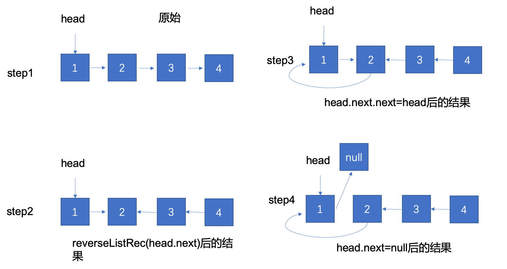
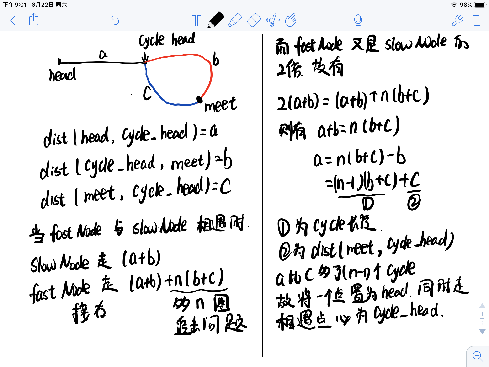

## 数组与链表

## 基本知识

- ### Dummy Node in Linked List

  当链表结构发生变化时，reverse或者删除等操作，只要链表结构发生变化，head就有可能发生变化，因此需要使用DummyHead

- ### Basic Linked List Skills

- ### Two Pointers in Linked List（Fast-slow pointers）


## 部分题目

### [2.Add Two Numbers](./2.add-two-numbers.java)

- 题目描述

  You are given two non-empty linked lists representing two non-negative integers. The digits are stored in reverse order and each of their nodes contain a single digit. Add the two numbers and return it as a linked list.

  You may assume the two numbers do not contain any leading zero, except the number 0 itself.

  **Example:**

  ```
  Input: (2 -> 4 -> 3) + (5 -> 6 -> 4)
  Output: 7 -> 0 -> 8
  Explanation: 342 + 465 = 807.
  ```

- 思路：

  头插法，首先声明一个dummyHead，因为链表的head是要不停发生变化的。声明一个currentNode作为游标，所指的为当前链表的末尾。声明carry记录进位
  循环直至两链表都到末尾
    - 使用x记录l1的值，使用y记录l2的值。将x+y+carry作为下一个结点的值
    - 将新结点插入到currentNode的next
    - 更新currentNode

### [24.Swap Nodes in Pairs](./24.swap-nodes-in-pairs.java)

- 题目描述

  Given a linked list, swap every two adjacent nodes and return its head.
  You may not modify the values in the list's nodes, only nodes itself may be changed.

  **Example:**  

  ```Given 1->2->3->4you should return the list as 2->1->4->3.```

- 思路

  每次循环以（currentNode，firstNode，secondNode）为单位进行处理。大体思路是对firstNode和secondNode进行交换。交换后将currentNode的next置为交换后的头节点。将currentNode置为交换后的尾节点后进行下一次循环。

  

### [206.Reverse Linked List](./206.reverse-linked-list.java)

- 题目描述：

  Reverse a singly linked list.

  **Example:**

  ```java
  Input: 1->2->3->4->5->NULL
  Output: 5->4->3->2->1->NULL
  ```

- 思路：

  - 递归解法

    因为给的参数是head，因此第一步是对head后面的元素进行reverse，然后将head插入reverse末尾并将head的next置为null。这里有一个tip是找reverse后链表的末尾是不用遍历该链表的，因为head的next是reverse后的最后一个节点。

    

  - 迭代解法

    迭代解法的思想是交换相邻两个元素的指针方向，可以看作是头插法。

### [141.Linked List Cycle](./141.linked-list-cycle.java)

- 题目描述：

  Given a linked list, determine if it has a cycle in it.

  To represent a cycle in the given linked list, we use an integer pos which represents the position (0-indexed) in the linked list where tail connects to. If pos is -1, then there is no cycle in the linked list.

- 思路：

  使用快慢节点的方法，设置fastNode，每次移动两步，设置一个slowNode每次移动一步，若有环快节点一定可以追上慢节点。数学证明其实就是假设cycle包含的节点是n个，当slowNode到达intersection时候可以根据初始情况计算出fastNode的位置，转换成小学的追击问题。
  **注：**因为fastNode每次移动两个，一定要判断fastNode.next不为空，否则会有空指针异常。

### [142.Linked List Cycle II](./142.linked-list-cycle-ii.java)

- 题目描述：

  Given a linked list, return the node where the cycle begins. If there is no cycle, return null.

  To represent a cycle in the given linked list, we use an integer pos which represents the position (0-indexed) in the linked list where tail connects to. If pos is -1, then there is no cycle in the linked list.

  Note: Do not modify the linked list.

- 思路：

  环的检测同141. 解法。之后的思路如下图：
  

### [25. Reverse Nodes in k-Group](./25.reverse-nodes-in-k-group.java)

- 题目描述：

  Given a linked list, reverse the nodes of a linked list k at a time and return its modified list.
  
  k is a positive integer and is less than or equal to the length of the linked list. If the number of nodes is not a multiple of k then left-out nodes in the end should remain as it is.

  Example:
  ```
  Given this linked list: 1->2->3->4->5
  For k = 2, you should return: 2->1->4->3->5
  For k = 3, you should return: 3->2->1->4->5
  ```

- 思路：
  - 迭代

    关键参数：

    dummyHead 假的组头

    head reverse的起始结点

    currentNode reverse的tail结点

    迭代的思路与[24.Swap Nodes in Pairs](https://leetcode.com/problems/swap-nodes-in-pairs/)的思路相近，都是先找一个一组(每k个为一组)的dummyHead，开始的时候可以先new一个。
    接着对每一个组进行reverse(封装为函数方便复用)
    更新dummyHead、head和currentNode

  - 递归

    先对前k个进行reverse

    对后面剩余的链表进行递归操作

    将第一步得到的尾结点的next置为第二步得到的头结点。


