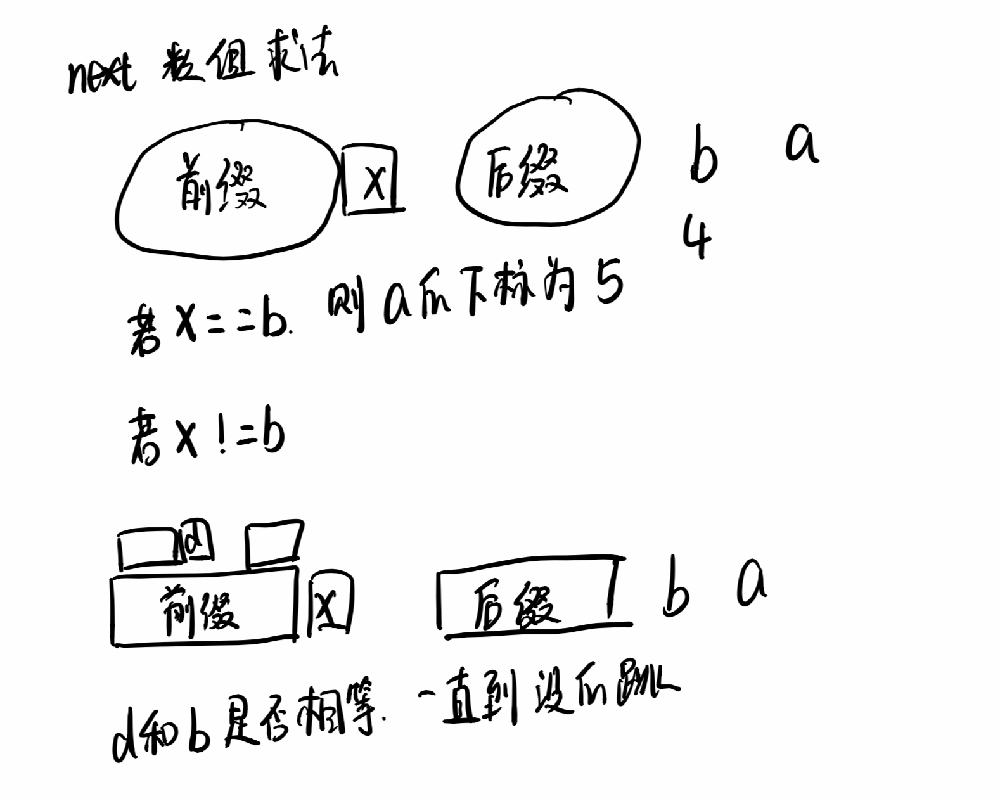

## <center>字符串</center>

## 主要涉及的方法

- 滑动窗口
- 双指针（一般双指针比滑动窗口灵活）
- 回溯
- 动态规划

## 部分例题

### [3.Longest Substring Without Repeating Characters](./3.longest-substring-without-repeating-characters.java)

- 题目描述

  Given a string, find the length of the **longest substring** without repeating characters.

  **Example 1:**

  ```java
  Input: "abcabcbb"
  Output: 3 
  Explanation: The answer is "abc", with the length of 3. 
  ```

  **Example 2:**

  ```java
  Input: "bbbbb"
  Output: 1
  Explanation: The answer is "b", with the length of 1.
  ```

- 思路

  利用双指针的思想，leftPointer和rightPointer代表substring的边界。主要步骤：
  
  - 保持leftPointer不变，不断更新rightPointer，此时[leftPointer,rightPointer]表示当前以rightPointer结尾的字串。
  - 查询rightPointer对应的字符是否出现过，若出现过，则更新leftPointer至rightPointer上次出现位置的下一个位置，为了防止leftPointer回退（因为上次出现的位置可能在leftPointer的前面），因此对上一位置与leftPointer当前位置进行比较，选取较大的值。换种思考方式其实就是如果rightPointer的元素在leftPointer前面出现，则不用管，因为当前的substring不包含该元素，若在leftPointer后面，则在当前的substring中，要进行更新。
  - 更新当前长度
  - 更新rightPointer
  

### [5.Longest Palindromic Substring](./5.longest-palindromic-substring.java)

- 题目描述

  Given an input string (`s`) and a pattern (`p`), implement regular expression matching with support for `'.'` and `'*'`.

  ```
  '.' Matches any single character.
  '*' Matches zero or more of the preceding element.
  ```

  The matching should cover the **entire** input string (not partial).

  **Note:**

  - `s` could be empty and contains only lowercase letters `a-z`.
  - `p` could be empty and contains only lowercase letters `a-z`, and characters like `.` or `*`.

  **Example 1:**

  ```java
  Input:
  s = "aa"
  p = "a"
  Output: false
  Explanation: "a" does not match the entire string "aa".
  ```

  **Example 2:**

  ```java
  Input:
  s = "aa"
  p = "a*"
  Output: true
  Explanation: '*' means zero or more of the preceding element, 'a'. Therefore, by repeating 'a' once, it becomes "aa".
  ```

  **Example 3:**

  ```java
  Input:
  s = "ab"
  p = ".*"
  Output: true
  Explanation: ".*" means "zero or more (*) of any character (.)".
  ```

  **Example 4:**

  ```java
  Input:
  s = "aab"
  p = "c*a*b"
  Output: true
  Explanation: c can be repeated 0 times, a can be repeated 1 time. Therefore, it matches "aab".
  ```

  **Example 5:**

  ```java
  Input:
  s = "mississippi"
  p = "mis*is*p*."
  Output: false
  ```

- 思路
  
  - 

### [10.Regular Expression Matching](./10.regular-expression-matching.java)

- 题目描述

  

- 思路

  首先进行数组的遍历，同时维护一个下标窗口来保存窗口的最大值。总体的思路为：
  将失效元素的下标移除。如遍历到第五个元素，窗口值为3时候，此时最大值只可能出现在3，4，5中，将0，1，2称为失效元素。**因为每次只滑动一个值，因此每次也只有一个元素失效，所以这边用if代替while**
  第二步是判断当前元素与已经遍历元素的关系，若之前的元素比当前元素小，则之前元素没有资格成为当前窗口的最大值，因此将之前元素下标移除。
  判断是否到达一个窗口的极限，若此时到了一个窗口的边界，则将此时的最大值（在队头）存入结果中。

### [14.Longest Common Prefix](./14.longest-common-prefix.java)

- 题目描述

  Write a function to find the longest common prefix string amongst an array of strings.

  If there is no common prefix, return an empty string `""`.

  **Example 1:**

  ```java
  Input: ["flower","flow","flight"]
  Output: "fl"
  ```

  **Example 2:**

  ```java
  Input: ["dog","racecar","car"]
  Output: ""
  Explanation: There is no common prefix among the input strings.
  ```

- 思路

  因为要是前缀，所以必须要从第一个元素开始就要相同。因此大体思路是使用第一个元素作为prefix也就是结果，然后对后面的每个元素进行遍历查看前缀是否与prefix一致，若不一致则将prefix的最后一位discard掉继续比较直到prefix为空字符串或者匹配到。


### [20.Valid Parentheses](./20.valid-parentheses.java)

- 题目描述

  Given a string containing just the characters `'('`, `')'`, `'{'`, `'}'`, `'['` and `']'`, determine if the input string is valid.

  An input string is valid if:

  1. Open brackets must be closed by the same type of brackets.
  2. Open brackets must be closed in the correct order.

  Note that an empty string is also considered valid.

  **Example:**

  ```java
  Input: "()"
  Output: true
    
  Input: "()[]{}"
  Output: true
    
  Input: "(]"
  Output: false
  ```
  
- 思路

  利用栈的思想。遇到开始的符号将对应的结束符号入栈，当遇到结束符号时候看栈顶元素是否与此符号相等。


### [22.Generate Parentheses](./22.generate-parentheses.java)

- 题目描述

  Given *n* pairs of parentheses, write a function to generate all combinations of well-formed parentheses.

  For example, given *n* = 3, a solution set is:

  **Example:**

  ```java
  [
    "((()))",
    "(()())",
    "(())()",
    "()(())",
    "()()()"
  ]
  ```
  
- 思路

  使用回溯的方法。回溯法的三个要点：

  - Choices
  - Constraints
  - Goals

  在本题中，每个递归只有两种选择：添加"("或者添加")"。因为给定一个n，会有n个"("和n个")"。而添加左括号的限制条件是当左括号的个数小于n的时候，添加右括号的条件是当左括号的个数大于右括号的个数的时候。当两种括号的个数都为n的时候表示这是一种组合，添加到结果数组中即可。


### [28.Implement strStr()](./28.implement-str-str.java)

- 题目描述

  其实就是实现一个KMP算法

  Return the index of the first occurrence of needle in haystack, or **-1** if needle is not part of haystack.

  **Example 1:**

  ```java
  Input: haystack = "hello", needle = "ll"
  Output: 2
  ```

  **Example 2:**

  ```java
  Input: haystack = "aaaaa", needle = "bba"
  Output: -1
  ```

- 思路

  实现KMP算法 

  - next数组的求解
  
    **next数组记录的是当前位置之前的字符串最长前缀和后缀匹配的长度(不包含当前字符)。且前缀不包含最后一个字符，后缀不包含第一个字符。**
  
    - 初始化第一个位置为-1，第二个位置为0
    - right记录当前计算的位置，left记录当前最大匹配到前缀的位置
    - 若当前字符的前一个字符与left相等，则next[right] = left+1
    - 若不等
      - 若left在最左端，则只能right++，当前next[right]=0
      - 若不在最左端，则将left跳到next[left]中去。
  
  - 算法过程
  
    **算法的思想是str1的下标只会向前移动，而str2的下标根据求出的next数组移动**
  
    - 若匹配，则str1和str2的index都向前移动
    - 若不匹配
      - 若next[str2Index]==-1，表示已经移动到开头了。只将str1的下标向前移动
      - 若不等于-1，则将str1的下标移动到next数组对应的位置去。
  
  - KMP算法过程实质
  
    
  
  - next数组求解过程
  
    ​	
  
    
  
    
- 参考资料
    - [youtube视频](https://www.youtube.com/watch?v=GTJr8OvyEVQ&t=2s)

  

### [44.Wildcard Matching](./44.wildcard-matching.java)

- 题目描述
- 思路

### [49.Group Anagrams](./49.group-anagrams.java)

- 题目藐视
- 思路

### [76.Minimum Window Substring](./76.minimum-window-substring.java)

- 题目描述

  Given a string S and a string T, find the minimum window in S which will contain all the characters in T in complexity O(n).

  **Example:**

  ```java
  Input: S = "ADOBECODEBANC", T = "ABC"
  Output: "BANC"
  ```

  **Note:**

  - If there is no such window in S that covers all characters in T, return the empty string `""`.
  - If there is such window, you are guaranteed that there will always be only one unique minimum window in S.

- 思路

  使用滑动窗口的方法。

  - 思路一：滑动窗口+hashmap的方法

    滑动窗口的大体思路使用rightPointer去进行expand窗口，接着通过leftPointer去contract窗口。在本题中，先对rightPointer进行自增操作，当找到一个满足条件的窗口时候对leftPointer进行自增操作。以此类推，直到rightPointer到末尾。

    hashmap是用来验证窗口是否满足条件的。设置一个count变量初始化为t的长度，将t中各个字母出现的频次存储hashmap中，当遍历s串的时候，若hashmap有该元素且大于0的时候，对count进行减操作。当count为0的时候表明该窗口满足条件。

  - 思路二：滑动窗口+数组（思路一的改进）

    大体思路与思路一相同，只是当rightPointer移动的时候，对required数组的元素进行减一操作。因此对应当移动leftPointer的时候对required数组的元素进行加一操作。因此t字符串中的元素会大于0，而t字符串以外的元素在rightPointer移动的时候会小于0当leftPointer移动的时候会等于0。其余的操作基本都一样。

### [91.Decode Ways](./91.decode-ways.java)

- 题目描述
- 思路

### [125.Valid Palindrome](./125.valid-palindrome.java)

- 题目描述
- 思路

### [227.Basic Calculator II](./227.basic-calculator-ii.java)

- 题目描述
- 思路

### [344.Reverse String](./344.reverse-string.java)

- 题目描述

  Write a function that reverses a string. The input string is given as an array of characters `char[]`.

  Do not allocate extra space for another array, you must do this by **modifying the input array in-place** with O(1) extra memory.

  You may assume all the characters consist of [printable ascii characters](https://en.wikipedia.org/wiki/ASCII#Printable_characters).

  **Example :**

  ```java
  Input: ["h","e","l","l","o"]
  Output: ["o","l","l","e","h"]
  
  Input: ["H","a","n","n","a","h"]
  Output: ["h","a","n","n","a","H"]
  ```

  

- 思路

  利用双指针，一个指向开头一个指向结尾。交换对应元素即可。

### [387First Unique Character in a String](./387.first-unique-character-in-a-string.java)

- 题目描述

  Given a string, find the first non-repeating character in it and return it's index. If it doesn't exist, return -1.

  **Examples:**

  ```java
  s = "leetcode"
  return 0.
  
  s = "loveleetcode",
  return 2.
  ```

  **Note:**You may assume the string contain only lowercase letters.

  

- 思路

  因为只包含小写字母，因此只要申请长度为26的数组，遍历字符串，在对应的位置(字符-'a')记录字符出现的频次。

  遍历字符串的每一个字符，找到第一个频次为1的字符返回下标。

