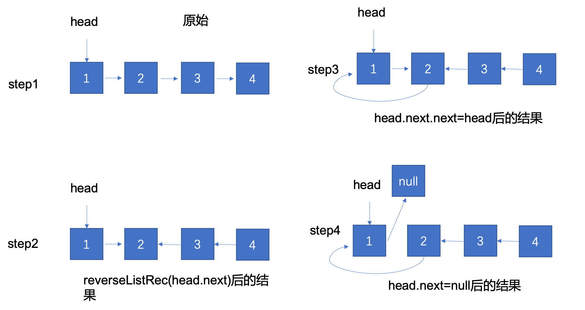

## 数组与链表
###[24.Swap Nodes in Pairs](https://leetcode.com/problems/swap-nodes-in-pairs/description/)

- 题目描述
  Given a linked list, swap every two adjacent nodes and return its head.
  You may not modify the values in the list's nodes, only nodes itself may be changed.
  **Example:**  

  ```Given 1->2->3->4you should return the list as 2->1->4->3.```

- 思路

  每次循环以（currentNode，firstNode，secondNode）为单位进行处理。大体思路是对firstNode和secondNode进行交换。交换后将currentNode的next置为交换后的头节点。将currentNode置为交换后的尾节点后进行下一次循环。

  

###[206.Reverse Linked List](https://leetcode.com/problems/reverse-linked-list/description/)

- 题目描述：

  Reverse a singly linked list.

  **Example:**

  ```java
  Input: 1->2->3->4->5->NULL
  Output: 5->4->3->2->1->NULL
  ```

- 思路：

  - 递归解法

    因为给的参数是head，因此第一步是对head后面的元素进行reverse，然后将head插入reverse末尾并将head的next置为null。这里有一个tip是找reverse后链表的末尾是不用遍历该链表的，因为head的next是reverse后的最后一个节点。

    

  - 迭代解法
    迭代解法的思想是交换相邻两个元素的指针方向，可以看作是头插法。

### [141.Linked List Cycle](https://leetcode.com/problems/linked-list-cycle/description/)
- 题目描述：
  Given a linked list, determine if it has a cycle in it.

  To represent a cycle in the given linked list, we use an integer pos which represents the position (0-indexed) in the linked list where tail connects to. If pos is -1, then there is no cycle in the linked list.
- 思路：
  使用快慢节点的方法，设置fastNode，每次移动两步，设置一个slowNode每次移动一步，若有环快节点一定可以追上慢节点。数学证明其实就是假设cycle包含的节点是n个，当slowNode到达intersection时候可以根据初始情况计算出fastNode的位置，转换成小学的追击问题。
  **注：**因为fastNode每次移动两个，一定要判断fastNode.next不为空，否则会有空指针异常。


